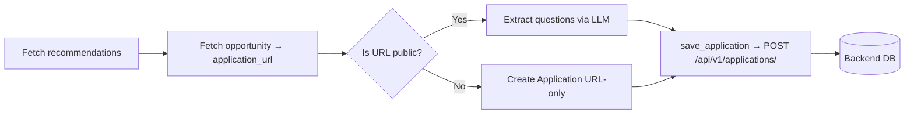

# Application Scraper Agent

The **Application Form Web Scraper Agent** (Agent 3) for Win The Opportunity. This is a standalone service that runs on a daily schedule to create applications from recommendations.

## Overview

This agent runs **daily after Agent 2 (Recommender)**. It:
1. Fetches all recommendations (for all users).
2. For each recommendation, gets the opportunity's `application_url`.
3. If the URL is **public**, fetches the form HTML and extracts questions + constraints.
4. Creates an `Application` — **with questions** if extracted, or **URL-only** (no questions) if the form is behind authentication.



### Key design points

- **Standalone service** — deployed separately from the backend.
- **Cron-driven** — runs daily after the recommender.
- **No direct DB access** — creates applications via the backend's HTTP API.
- **Playwright for fetching** — headless Chromium to load the form page.
- **Title from `<title>` tag** — the application title is taken from the page's title tag.
- **Captures field details** — `field_type`, `is_required`, `max_characters`, `max_words` for each question.
- **Handles authenticated forms** — creates an Application with no questions (`questions_extracted=False`) when the URL isn't public; the user later uploads screenshots (Agent 4) to complete it.

## Project Structure

```
application-scraper/
├── app/
│   ├── __init__.py      # exports build_agent, extract_application
│   ├── agent.py         # agent orchestration
│   ├── tools.py         # save_application tool
│   ├── config.py        # settings
│   ├── model.py         # model provider (OpenRouter)
│   ├── prompts.py       # EXTRACTION_PROMPT
│   ├── schemas.py       # ExtractedQuestion, ExtractedApplication
│   └── scraper.py       # Playwright form fetching
├── Dockerfile
├── pyproject.toml
├── env_example
└── .env
```

## Prerequisites

- Python 3.14+
- [uv](https://docs.astral.sh/uv/) (package manager)
- An [OpenRouter](https://openrouter.ai/) API key
- The **backend** running (so `save_application` can POST to it)

## Setup

### 1. Install dependencies

```bash
cd application-scraper
uv sync
```

### 2. Install Playwright Chromium

```bash
uv run playwright install chromium
```

### 3. Configure environment

Copy `env_example` to `.env` and fill in your values:

```bash
cp env_example .env
```

| Variable | Description | Default |
|---|---|---|
| `API_BASE_URL` | Base URL of the backend API | `http://localhost:8000` |
| `OPENROUTER_API_KEY` | Your OpenRouter API key | — |
| `OPENROUTER_BASE_URL` | OpenRouter endpoint | `https://openrouter.ai/api/v1` |
| `AGENT_MODEL_ID` | Model used by the agent | `deepseek/deepseek-v4-flash-0731` |

## Usage

### Run the daily cron flow

```bash
uv run python -m app.agent
```

This processes all recommendations, fetches each opportunity's application URL, and creates applications (with or without questions).

> **Important:** The backend must be running first, since the agent reads recommendations/opportunities and POSTs applications to `POST /api/v1/applications/`.

## Tools

| Tool | Description |
|---|---|
| `fetch_recommendations` | Fetch all recommendations (for all users) |
| `fetch_opportunity` | Fetch a single opportunity by id |
| `save_application` | Create an application with its questions via the backend API |

## Docker

```bash
docker build -t application-scraper .
docker run --env-file .env application-scraper "https://example.com/apply"
```

## Related

- [`backend/`](../backend) — the FastAPI backend that owns the database.
- [`scraper-agent/`](../scraper-agent) — Agent 1, scrapes opportunities.
- [`recommender/`](../recommender) — Agent 2, recommends opportunities.