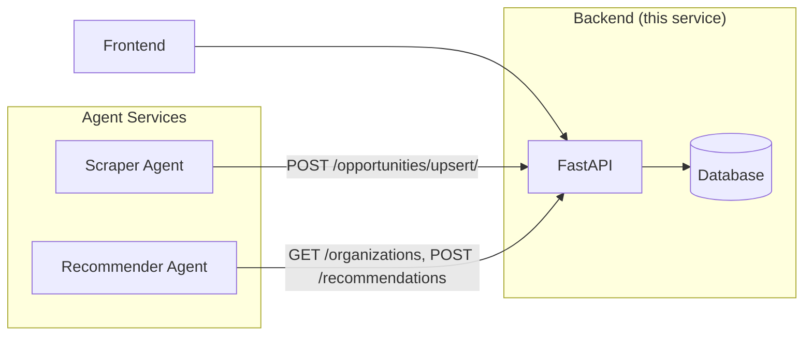

# Backend

The **FastAPI backend** for Win The Opportunity. This service owns the database and exposes the REST API that the frontend and the agent services (scraper, recommender) interact with.

## Overview

The backend is the central data service. It:
- Owns the database (SQLite by default, via SQLAlchemy + Alembic migrations).
- Exposes REST endpoints for users, organizations, opportunities, applications, and recommendations.
- Is consumed by the frontend and by the standalone agent services over HTTP.



## Project Structure

```
backend/
├── app/
│   ├── main.py            # FastAPI app entry point
│   ├── api/
│   │   ├── main.py        # API router registration
│   │   ├── deps.py        # dependencies (DB session, auth)
│   │   └── routes/        # endpoint definitions
│   │       ├── users.py
│   │       ├── login.py
│   │       ├── organizations.py
│   │       ├── opportunities.py
│   │       ├── applications.py
│   │       └── recommendations.py
│   ├── core/
│   │   ├── config.py      # settings
│   │   ├── database.py    # SQLAlchemy engine/session
│   │   ├── security.py    # password hashing, JWT
│   │   └── logging.py
│   ├── models/            # SQLAlchemy ORM models
│   │   ├── user.py
│   │   ├── organization.py
│   │   ├── opportunity.py
│   │   └── application.py
│   ├── schemas/           # Pydantic schemas
│   ├── crud/              # database operations
│   └── services/          # business logic
├── alembic/               # database migrations
├── pyproject.toml
└── env_example
```

## Prerequisites

- Python 3.14+
- [uv](https://docs.astral.sh/uv/) (package manager)

## Setup

### 1. Install dependencies

```bash
cd backend
uv sync
```

### 2. Configure environment

Copy `env_example` to `.env` and fill in your values:

```bash
cp env_example .env
```

| Variable | Description | Default |
|---|---|---|
| `DATABASE_URL` | Database connection string | `sqlite:///./wintheopportunity.db` |
| `SECRET_KEY` | JWT signing secret | `development-only-change-this-secret` |
| `OPENROUTER_API_KEY` | OpenRouter key (for agents) | — |
| `OPENROUTER_BASE_URL` | OpenRouter endpoint | `https://openrouter.ai/api/v1` |
| `AGENT_MODEL_ID` | Default agent model | `deepseek/deepseek-v4-flash-0731` |

### 3. Run migrations

```bash
uv run alembic upgrade head
```

### 4. Run the server

```bash
uv run uvicorn app.main:app --reload
```

The API will be available at `http://localhost:8000`, with interactive docs at `http://localhost:8000/docs`.

## API Endpoints

| Method | Path | Description |
|---|---|---|
| `POST` | `/api/v1/users/` | Create a user (and organization) |
| `GET` | `/api/v1/users/` | List users |
| `GET` | `/api/v1/users/{id}/` | Get a user |
| `POST` | `/api/v1/auth/login/` | Login (form data) → JWT |
| `GET` | `/api/v1/organizations/` | List all organizations |
| `GET` | `/api/v1/organizations/me/` | Get current user's organization |
| `PUT` | `/api/v1/organizations/me/` | Update current user's organization |
| `GET` | `/api/v1/opportunities/` | List opportunities |
| `GET` | `/api/v1/opportunities/{id}/` | Get an opportunity |
| `POST` | `/api/v1/opportunities/` | Create an opportunity |
| `POST` | `/api/v1/opportunities/upsert/` | Bulk upsert opportunities (scraper) |
| `POST` | `/api/v1/applications/` | Create an application |
| `GET` | `/api/v1/applications/` | List applications |
| `GET` | `/api/v1/applications/{id}/` | Get application detail |
| `POST` | `/api/v1/recommendations/` | Bulk create recommendations (recommender) |
| `GET` | `/api/v1/recommendations/` | List current user's recommendations |

## Authentication

Most endpoints require a **Bearer token**. To authenticate:

1. `POST /api/v1/auth/login/` with form data (`email`, `password`) → returns `access_token`.
2. Send the token as `Authorization: Bearer <token>`.

## Migrations

Generate a new migration after model changes:

```bash
uv run alembic revision --autogenerate -m "Description"
uv run alembic upgrade head
```

## Related Services

- [`scraper-agent/`](../scraper-agent) — scrapes opportunities and POSTs them here.
- [`recommender/`](../recommender) — reads organizations/opportunities and POSTs recommendations here.
