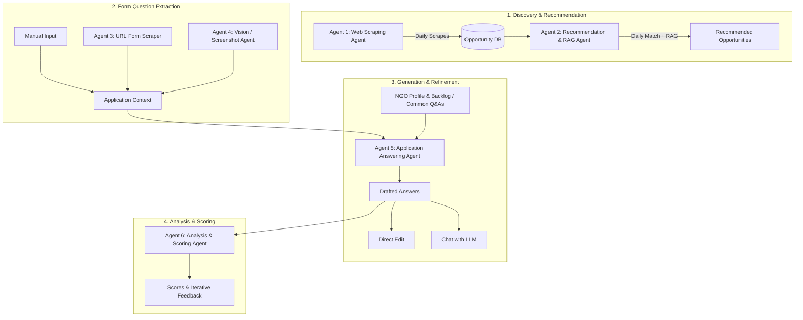

Searched for files matching `**/backend/**`, 20 matches

Yes, I understand your vision completely! You are building an AI-powered agentic system tailored for NGOs and applicants to discover, manage, and craft winning applications for grants, scholarships, and opportunities.

Here is a structured breakdown of your architecture, agent responsibilities, data models, and user workflows based on your description:

---

### 1. Agent Ecosystem (6 Agents)



1. **Agent 1: Opportunity Scraping / Research Agent**
   - **Trigger**: Scheduled (e.g., daily cron job).
   - **Task**: Broad web scraping across grant/opportunity websites. Populates the global `Opportunity` table.
2. **Agent 2: Recommendation & RAG Agent**
   - **Trigger**: Runs daily after Agent 1 completes.
   - **Task**: Compares global opportunities against NGO profiles and context using RAG to produce personalized `RecommendedOpportunity` entries for each user.
3. **Agent 3: Application Form Web Scraper Agent**
   - **Trigger**: User inputs a public application URL.
   - **Task**: Extracts questions, character/word limits, and field context from unauthenticated web pages.
4. **Agent 4: Application Form Vision/Screenshot Agent**
   - **Trigger**: User uploads screenshots of behind-authentication forms.
   - **Task**: Uses Vision capabilities (OCR/Multimodal LLMs) to extract questions, character limits, and instructions.
5. **Agent 5: Application Answering Agent**
   - **Trigger**: User initiates answer generation.
   - **Task**: Uses RAG over the NGO's **Commonly Answered Questions** (historical application backlog), NGO context, and opportunity details to draft tailored answers.
6. **Agent 6: Analysis & Evaluation Agent**
   - **Trigger**: Post-answer generation or after user edit.
   - **Task**: Evaluates answer quality against opportunity expectations, scoring answers and providing actionable improvement feedback across iterations.

---

### 2. Core Data Models

Based on your FastAPI / SQLModel / SQLAlchemy structure, here are the main entity relationships:

* **`User` / `NGOProfile`**: Stores user authentication, NGO details, background, mission, focus areas, and specific context.
* **`Opportunity`**: Publicly scraped opportunities (title, provider, URL, description, requirements, deadline, categories).
* **`RecommendedOpportunity`**: User-specific opportunity recommendations (User ID, Opportunity ID, relevance score, reason for recommendation).
* **`Application`**: Represents a user's active/past application to an opportunity (User ID, Opportunity ID, status, extraction mode used).
* **`ApplicationQuestion`**: Questions belonging to an application (Question text, field limits, order, context).
* **`ApplicationAnswer`**: User or AI-generated answers linked to a question. Forms the **"Commonly Answered Questions"** backlog for future RAG retrieval once saved.
* **`AnswerEvaluation`**: Score, reasoning, and feedback notes generated by Agent 6. Linked 1-to-many with `ApplicationAnswer` to track historical iterations.
* **`AnswerChatSession`**: Stores conversational context when a user edits an answer by chatting with the LLM.

---

### 3. Application Workflow & Modes

```
[ User Selects Opportunity ] 
          │
          ├── Mode 1: Manual Copy/Paste
          ├── Mode 2: Submit Form URL (Agent 3 Scrapes)
          └── Mode 3: Upload Screenshots (Agent 4 Extracts via Vision)
          │
          ▼
[ Questions & Constraints Extracted ]
          │
          ▼
[ Agent 5 Generates Draft Answers ]
  (Uses NGO Profile + Backlog of "Commonly Answered Questions" via RAG)
          │
          ▼
[ User Review & Refinement ]
  ├── Direct Text Edit
  └── Chat with LLM to Polish Answer
          │
          ▼
[ Agent 6 Evaluates & Scores Answers ]
  (Generates reasoning & score per answer iteration)
```

---

### 4. Transitioning to FastAPI

In your FastAPI project structure, this translates cleanly to:

- **`app/models/`**: `user.py`, `opportunity.py`, `application.py`, `evaluation.py`
- **`app/api/routes/`**:
  - `opportunities.py` (List scraped & recommended opportunities)
  - `applications.py` (Manage user applications & Q&As)
  - `extractions.py` (Triggers for URL scraper & screenshot processing)
  - `copilot.py` / `chat.py` (Endpoints for answer generation, evaluation, and interactive LLM chat)
- **`app/services/`**:
  - `scraping.py` (Agent 1 & 3 logic)
  - `vision.py` (Agent 4 logic)
  - `rag.py` / `vector_store.py` (Embeddings & similarity search for Commonly Answered Questions)
  - `agents/` (LangChain / LlamaIndex / custom agent orchestration for Agents 2, 5, 6)

Does this align with how you want to proceed with designing the backend models and API endpoints?