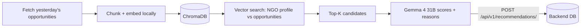

# Recommender Agent

The **Recommendation / RAG Agent** for Win The Opportunity. This is a standalone service that runs daily to match new opportunities against NGO profiles and produce personalized recommendations.

## Overview

This agent runs **daily after the scraper**. It uses a **hybrid matching** approach:
1. **Vector search** (fast recall) — embeds opportunities into a local ChromaDB store and finds top-K candidates for each NGO.
2. **LLM scoring** (quality) — uses Gemma 4 31B via OpenRouter to score and rank the candidates, writing a match reason for each.



### Key design points

- **Standalone service** — deployed separately from the backend (e.g., as an ECS scheduled task).
- **No direct DB access** — reads opportunities/organizations and writes recommendations via the backend's HTTP API.
- **Hybrid matching** — vector search for recall + LLM scoring for quality.
- **Local embeddings** — uses `sentence-transformers/all-MiniLM-L6-v2` (free, fast, no API cost).
- **ChromaDB** — persistent vector store for opportunity embeddings.

## Project Structure

```
recommender/
├── app/
│   ├── __init__.py      # exports build_recommender_agent, run_recommender
│   ├── agent.py         # recommendation pipeline orchestration
│   ├── tools.py         # all agent tools
│   ├── config.py        # settings (API_BASE_URL, model, ChromaDB)
│   ├── model.py         # model provider (Gemma via OpenRouter)
│   ├── prompts.py       # SCORING_PROMPT
│   ├── schemas.py       # ScoredRecommendation, RecommendationResult
│   └── rag.py           # ChromaDB + local embeddings + chunking
├── Dockerfile
├── pyproject.toml
├── env_example
└── .env
```

## Prerequisites

- Python 3.14+
- [uv](https://docs.astral.sh/uv/) (package manager)
- An [OpenRouter](https://openrouter.ai/) API key
- The **backend** running (so it can fetch data and save recommendations)

## Setup

### 1. Install dependencies

```bash
cd recommender
uv sync
```

> **Note:** This installs `chromadb`, `sentence-transformers`, and `torch`, which are large. The first run also downloads the embedding model from Hugging Face.

### 2. Configure environment

Copy `env_example` to `.env` and fill in your values:

```bash
cp env_example .env
```

| Variable | Description | Default |
|---|---|---|
| `API_BASE_URL` | Base URL of the backend API | `http://localhost:8000` |
| `OPENROUTER_API_KEY` | Your OpenRouter API key | — |
| `OPENROUTER_BASE_URL` | OpenRouter endpoint | `https://openrouter.ai/api/v1` |
| `AGENT_MODEL_ID` | Scoring model | `google/gemma-4-31b-it` |
| `CHROMA_PATH` | ChromaDB persistence path | `./chroma_db` |
| `EMBEDDING_MODEL` | Local embedding model | `sentence-transformers/all-MiniLM-L6-v2` |
| `RECOMMENDER_TOP_K` | Number of candidates per NGO | `10` |
| `RECOMMENDER_LOOKBACK_HOURS` | How far back to look for new opportunities | `24` |

## Usage

### Run the recommender

```bash
uv run python -m app.agent
```

> **Important:** The backend must be running first, since the agent reads opportunities/organizations and writes recommendations via the API.

## The Pipeline

1. **Fetch** — get opportunities created in the lookback window via `GET /api/v1/opportunities/`.
2. **Index** — chunk + embed each opportunity's description/eligibility/category into ChromaDB.
3. **Search** — for each NGO, query ChromaDB for top-K similar opportunities.
4. **Score** — the LLM scores each candidate (0.0–1.0) and writes a match reason.
5. **Save** — POST the scored recommendations to `POST /api/v1/recommendations/`.

## Tools

The agent uses the following tools (defined in `app/tools.py`):

| Tool | Description |
|---|---|
| `fetch_new_opportunities` | Fetch opportunities from the lookback window |
| `fetch_ngos` | Fetch all NGO profiles |
| `save_recommendations` | Persist scored recommendations via the backend API |

## Docker

Build and run the containerized recommender:

```bash
docker build -t recommender .
docker run --env-file .env recommender
```

## Deployment

This service is designed to run as a **batch job** on a schedule (daily, after the scraper). Suitable targets:

- **AWS ECS Scheduled Task** (Fargate) — runs the container on a cron schedule.
- **AWS Lambda** — for short, stateless runs.

## Related

- [`backend/`](../backend) — the FastAPI backend that owns the database and exposes the API.
- [`scraper-agent/`](../scraper-agent) — the scraper that populates opportunities before this agent runs.
