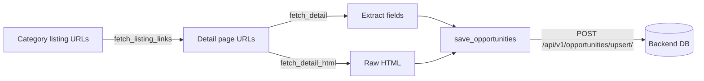

# Scraper Agent

The **Opportunity Scraping / Research Agent** for Win The Opportunity. This is a standalone service that discovers funding opportunities (grants, scholarships, fellowships, accelerators, awards, contests, training) from the web on a daily schedule and persists them to the backend via its HTTP API.

## Overview

This agent performs large-scale research of opportunities from listing websites. It is designed to run on a **daily schedule** and is deployed as its **own service**, separate from the backend.



### Key design points

- **Standalone service** — deployed separately from the backend (e.g., as an ECS scheduled task or Lambda).
- **No direct DB access** — the agent does NOT import database models, sessions, or CRUD. It persists opportunities by calling the backend's HTTP API.
- **Playwright for scraping** — uses a headless Chromium browser with pagination support to walk through entire listings.
- **Two-phase flow**:
  1. **Listing phase** — fetch category listing pages and extract detail-page URLs.
  2. **Detail phase** — fetch each detail page, extract full fields, and capture the raw HTML.

## Project Structure

```
scraper-agent/
├── app/
│   ├── __init__.py      # exports build_scraper_agent, run_scraper
│   ├── agent.py         # agent orchestration (builds agent, runs scraper)
│   ├── tools.py         # all agent tools
│   ├── config.py        # settings (API_BASE_URL, model, max_pages)
│   ├── model.py         # model provider (OpenRouter)
│   ├── prompts.py       # SCRAPER_PROMPT
│   ├── schemas.py       # ScrapedOpportunity, ScrapeResult
│   └── scraper.py       # Playwright scraping + pagination
├── Dockerfile           # containerized with Playwright Chromium
├── pyproject.toml       # dependencies
├── env_example          # template for .env
└── .env                 # actual configuration
```

## Prerequisites

- Python 3.14+
- [uv](https://docs.astral.sh/uv/) (package manager)
- An [OpenRouter](https://openrouter.ai/) API key
- The **backend** running (so `save_opportunities` can POST to it)

## Setup

### 1. Install dependencies

```bash
cd scraper-agent
uv sync
```

### 2. Install Playwright Chromium

```bash
uv run playwright install chromium
```

### 3. Configure environment

Copy `env_example` to `.env` and fill in your values:

```bash
cp env_example .env
```

| Variable | Description | Default |
|---|---|---|
| `API_BASE_URL` | Base URL of the backend API | `http://localhost:8000` |
| `OPENROUTER_API_KEY` | Your OpenRouter API key | — |
| `OPENROUTER_BASE_URL` | OpenRouter endpoint | `https://openrouter.ai/api/v1` |
| `AGENT_MODEL_ID` | Model used by the agent | `deepseek/deepseek-v4-flash-0731` |
| `SCRAPER_MAX_PAGES` | Max pages to scrape per listing | `3` |

## Usage

### Run the scraper

```bash
uv run python -m app.agent
```

> **Important:** The backend must be running first, since the agent POSTs scraped opportunities to `POST /api/v1/opportunities/upsert/`.

### Seed URLs

The seed listing URLs are defined in the `__main__` block of `app/agent.py`. Update them to point at the category listing pages you want to scrape.

## Tools

The agent uses the following tools (defined in `app/tools.py`):

| Tool | Description |
|---|---|
| `fetch_listing` | Fetch a listing page (and paginated pages), return text |
| `fetch_listing_links` | Fetch a listing page and return detail-page URLs |
| `fetch_detail` | Fetch a single detail page, return stripped text |
| `fetch_detail_html` | Fetch a single detail page, return raw HTML |
| `save_opportunities` | Persist opportunities via the backend API (upsert) |

## Docker

Build and run the containerized scraper:

```bash
docker build -t scraper-agent .
docker run --env-file .env scraper-agent
```

## Deployment

This service is designed to run as a **batch job** on a schedule. Suitable targets:

- **AWS ECS Scheduled Task** (Fargate) — runs the container on a cron schedule.
- **AWS Lambda** — for short, stateless scrape runs.

It is intentionally a **separate deployable** from the backend, so it can be scheduled and scaled independently.

## Related

- [`backend/`](../backend) — the FastAPI backend that owns the database and exposes the API.
- [`recommender/`](../recommender) — the recommendation/RAG agent that runs after this scraper.
